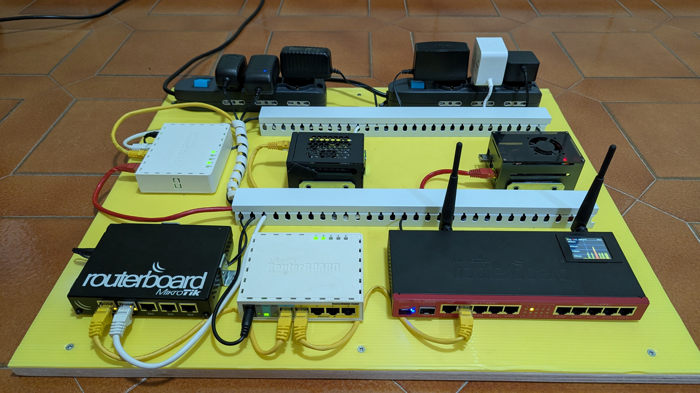
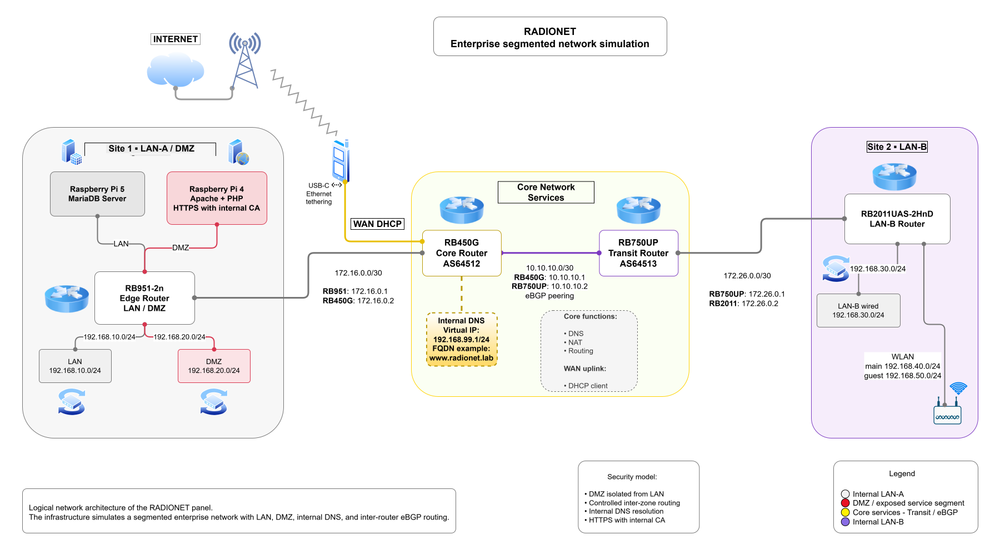

# RADIONET

Enterprise segmented network simulation with MikroTik routers, DMZ, internal DNS, eBGP, HTTPS, and Raspberry Pi services.



## Overview

RADIONET is a practical network infrastructure project designed to simulate an enterprise segmented architecture using MikroTik RouterOS and Raspberry Pi systems.

The project demonstrates:

- LAN and DMZ segmentation
- Core routing and transit routing
- Internal DNS resolution
- eBGP peering between autonomous systems
- HTTPS web service with internal CA
- Separation between wired and wireless client networks

---

## Logical Topology



---

## Network Architecture

### Site 1 — LAN-A / DMZ

* MikroTik RB951-2n edge router
* Raspberry Pi 5 running MariaDB
* Raspberry Pi 4 running Apache + PHP + HTTPS

Subnets:

* LAN → `192.168.10.0/24`
* DMZ → `192.168.20.0/24`

### Core Network Services

- MikroTik RB450G core router
- Internal DNS virtual IP
- NAT
- WAN DHCP client
- eBGP endpoint

Subnets:

* Site1 transit → `172.16.0.0/30`

---

### Transit Segment

* MikroTik RB750UP transit router
* eBGP inter-router routing

Subnets:

* core transit → `10.10.10.0/30`
* site2 transit → `172.26.0.0/30`

---

### Site 2 — LAN-B

* MikroTik RB2011UAS-2HnD
* wired LAN + WLAN

Subnets:

* LAN-B wired → `192.168.30.0/24`
* WLAN main → `192.168.40.0/24`
* WLAN guest → `192.168.50.0/24`

---

## Core Technologies

- MikroTik RouterOS
- eBGP
- NAT
- Internal DNS
- HTTPS with internal CA
- MariaDB
- Apache + PHP
- Raspberry Pi infrastructure

---

## Security Model

- DMZ isolated from internal LAN
- Controlled inter-zone routing
- Internal DNS resolution
- HTTPS protected services

---

## Hardware gallery

Additional photos available in:

[`doc/photos.md`](doc/photos.md)

---

## Repository Structure

```text
radionet/
├── configs/
├── doc/
│   ├── photos/
│   ├── photos.md
│   └── radionet_topology_v2.svg
├── README.md
```

---

## License

MIT License
