# Hardware Specifications

## Network hardware specifications

| Product | Image | CPU / Architecture | RAM | RouterOS v7 | Recommended Role | Datasheet |
|----------|-------|--------------------|-----|--------------|------------------|------------|
| [RB2011UiAS-2HnD-IN](https://mikrotik.com/product/RB2011UiAS-2HnD-IN) | 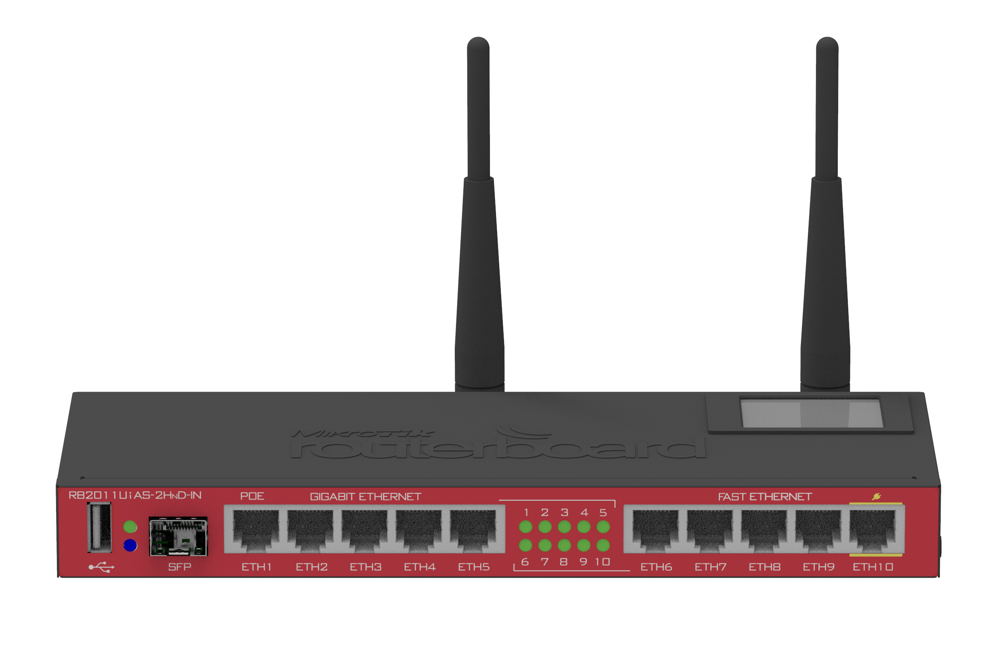 | AR9344 600 MHz – MIPSBE | 128 MB | ✅ Supported | Main router / core router | [PDF](./datasheets/RB2011UiAS-2HnD-IN_201121.pdf) |
| [RB750UP](https://mikrotik.com/product/RB750UP) | 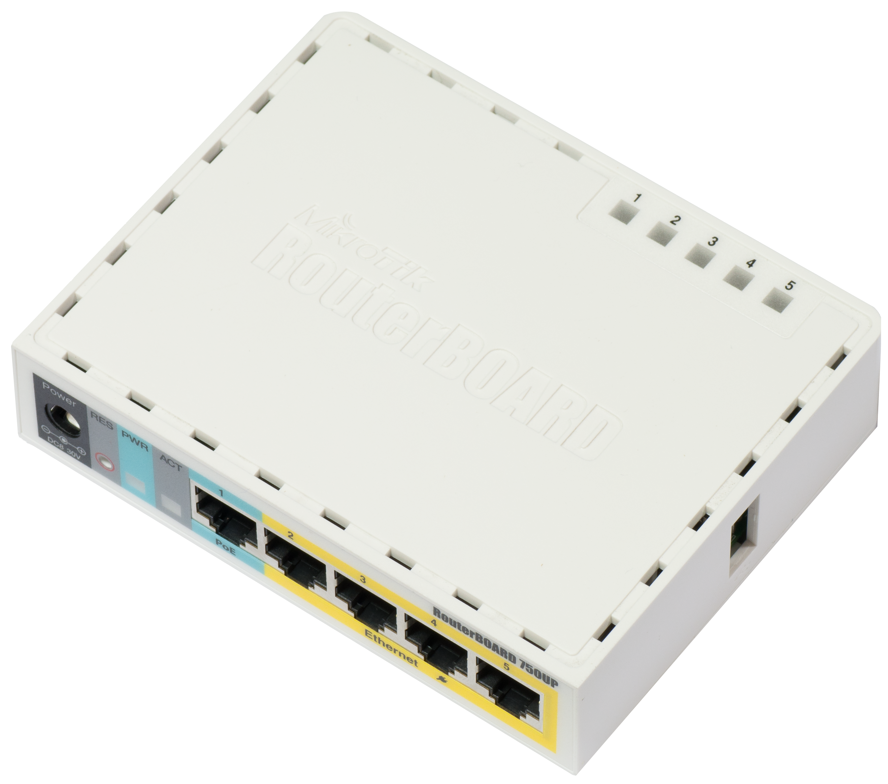 | AR7241 ~400 MHz – MIPSBE | 64 MB | ✅ Supported | Lightweight transit router | [PDF](./datasheets/rb750up_130511.pdf) |
| [RB450G](https://mikrotik.com/product/RB450G) | 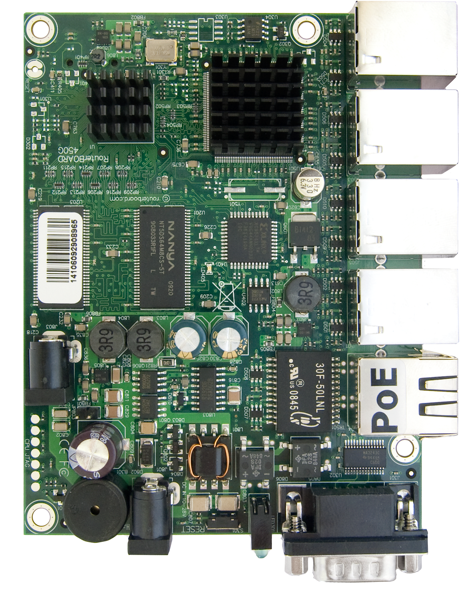 | AR7161 680 MHz – MIPSBE | 256 MB | ✅ Supported | High-performance core router | [PDF](./datasheets/RB450-both_130550.pdf) |
| [RB951-2n](https://mikrotik.com/product/RB951-2n) | 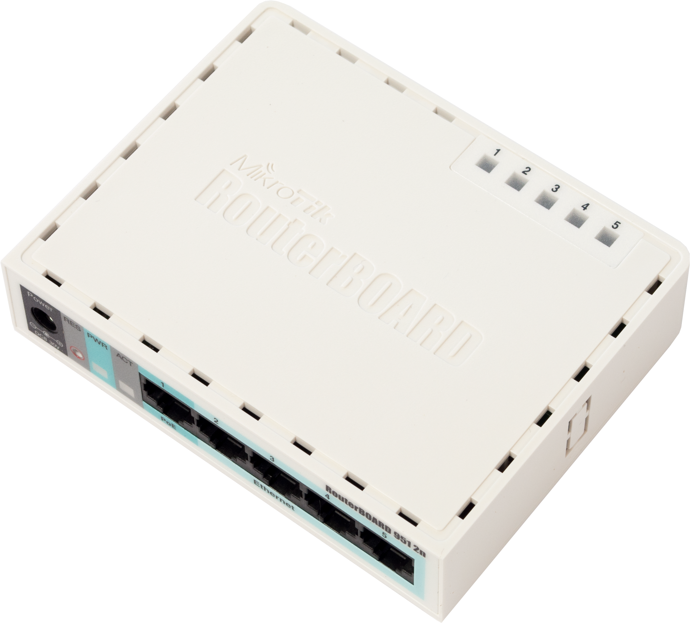 | AR9344 600 MHz – MIPSBE | 128 MB | ✅ Supported | LAN router / wireless access point | [PDF](./datasheets/rb951-2n_130506.pdf) |

---

## System Hardware specifications

| Product | Image | CPU / Architecture | RAM | OS | Kernel | Datasheet | Peripherals |
|----------|-------|--------------------|-----|--------------|------------------|------------|------------|
| [Raspberry Pi 4B](https://www.raspberrypi.com/products/raspberry-pi-4-model-b/) | 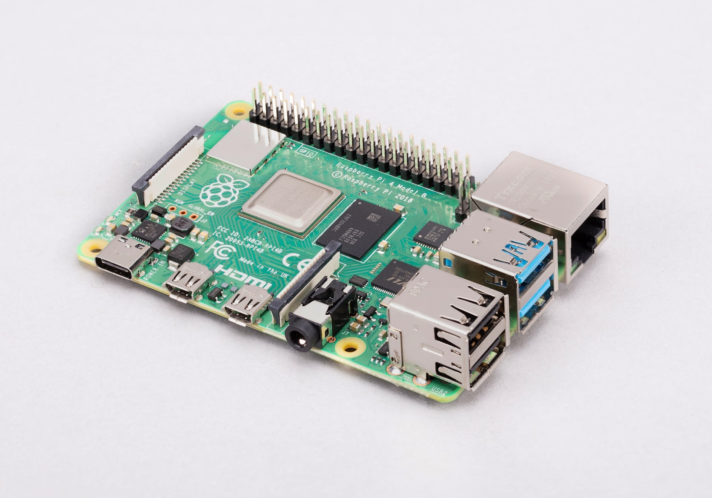 | Broadcom BCM2711 1.5 GHz – Cortex-A72 | 8 GB | 🐧 Debian 12 (Bookworm) | 6.12.75+rpt-rpi-v8 | [PDF](./datasheets/RP-008341-DS-1-raspberry-pi-4-datasheet.pdf) | [PDF](datasheets/RP-008248-DS-1-bcm2711-peripherals.pdf) |
| [Raspberry Pi 5](https://www.raspberrypi.com/products/raspberry-pi-5/) | 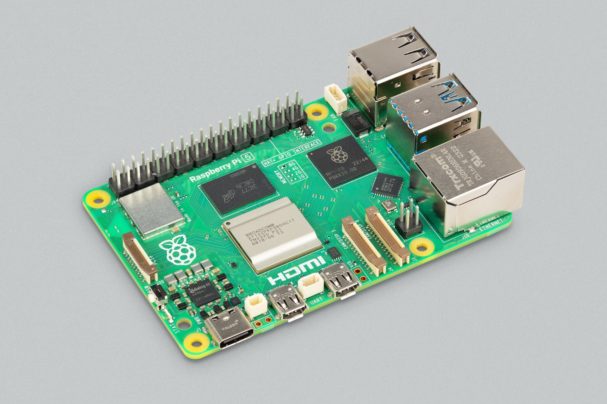 | Broadcom BCM2712 2.4 GHz – Cortex-A76 | 2 GB | 🐧 Debian 13 (Trixie) | 6.12.75+rpt-rpi-2712 | [PDF](./datasheets/RP-008348-DS-6-raspberry-pi-5-product-brief.pdf) | [PDF](datasheets/RP-008370-DS-1-rp1-peripherals.pdf) |

## Other hardware specs

### Case encloures + cooling + storage

| Product | Image | Vendor URL | used for | Datasheet | Wiki URL |
|----------|-------|-------|--------------------|-----|--------------|
|ZP-0153|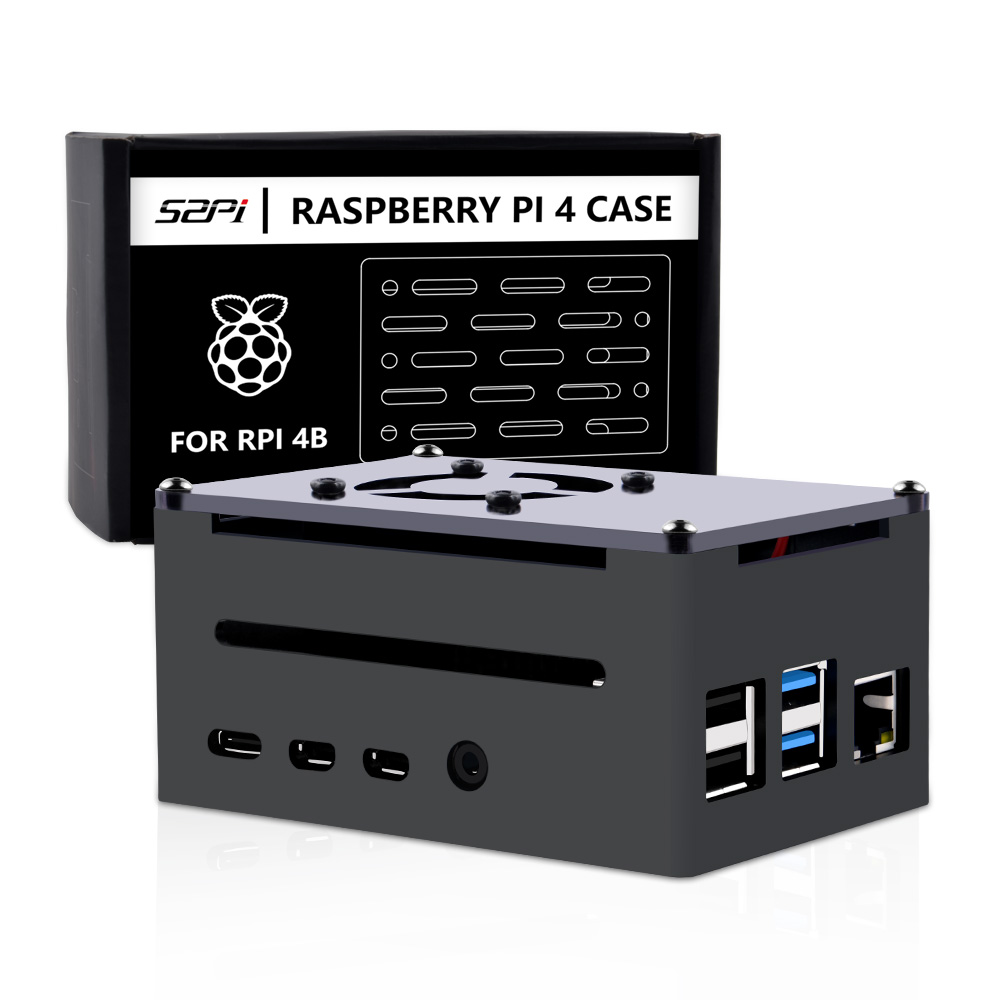|[52Pi.com](https://52pi.com/products/raspberry-pi-4-model-b-aluminum-case-black-metal-enlosure-shell-with-quiet-cooling-fan-for-rpi-4b-compatible-poe-hat)|Raspberry Pi 4|[PDF](./datasheets/ZP-0153-52Pi.pdf)|[URL](https://wiki.52pi.com/index.php?title=ZP-0153)|
|EP-0163|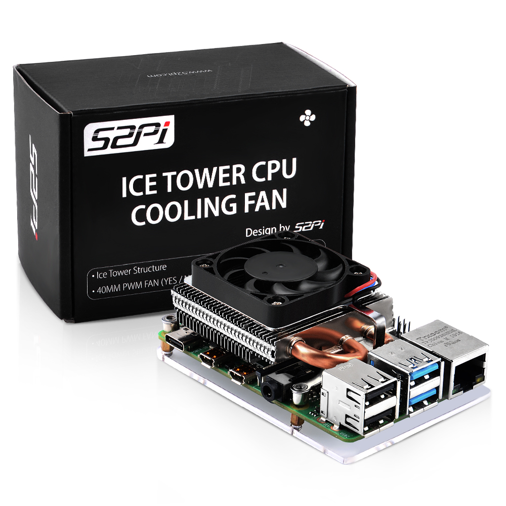|[52Pi.com](https://52pi.com/products/52pi-ultra-thin-ice-tower-cooler-cooling-fan-for-raspberry-pi-4-model-b-cpu-fan?_pos=2&_sid=0ac08a4ce&_ss=r)|Raspberry Pi 4|[PDF](./datasheets/EP-0163-52Pi.pdf)|[URL](https://wiki.52pi.com/index.php?title=EP-0163)|
|EP-0211|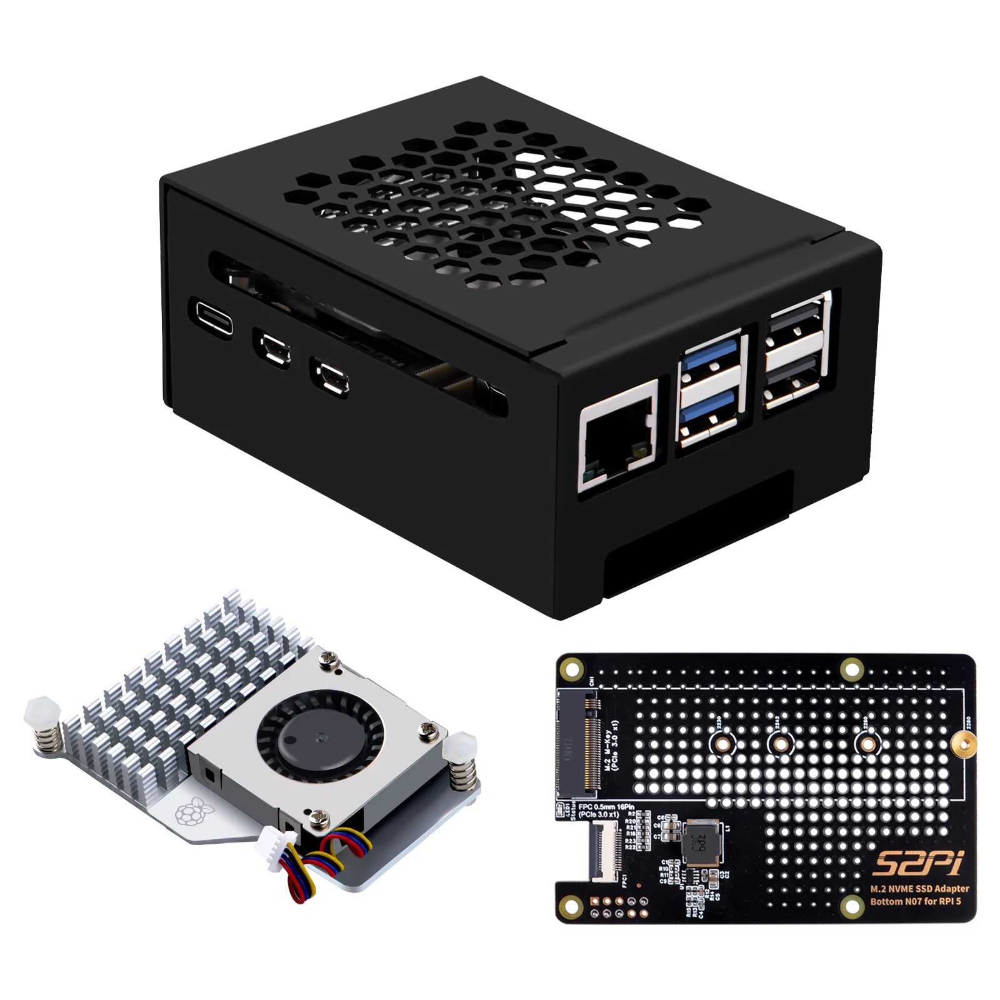|[52Pi.com](https://52pi.com/products/n07-m-2-2280-pcie-to-nvme-ssd-pcie-peripheral-bottom-board-with-metal-case-and-official-cooler-for-raspberry-pi-5)|Raspberry Pi 5|[PDF](./datasheets/EP-0211-52Pi.pdf)|[URL](https://wiki.52pi.com/index.php?title=EP-0211)|
| P3 500GB PCIe M.2 2280 SSD|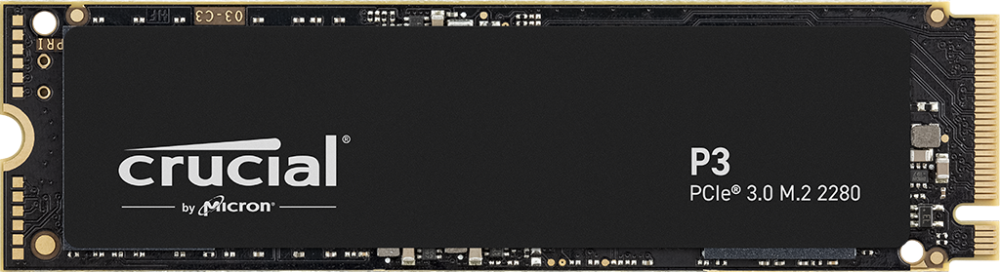|[Crucial](https://www.amazon.it/-/en/dp/B0B25LQQPC)|Raspberry Pi 5|[PDF](./datasheets/CT500P3SSD8.pdf)|[URL](https://it.crucial.com/ssd/p3/ct500p3ssd8)|
|CA150|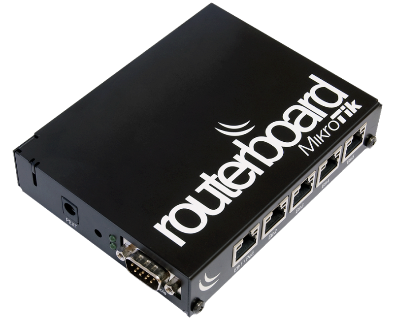|[Mikrotik](https://www.mikrotik-store.eu/en/MikroTik-CA150)|RB450G|[PDF](./datasheets/CA150.pdf)|[URL](https://mikrotik.com/product/CA150)|

 
---

## Notes

- All network devices are based on MikroTik RouterBOARD hardware.
- The infrastructure was tested using RouterOS v7.
- Devices were selected to simulate a small enterprise network environment with routing, DMZ, BGP, VLANs and wireless segmentation.