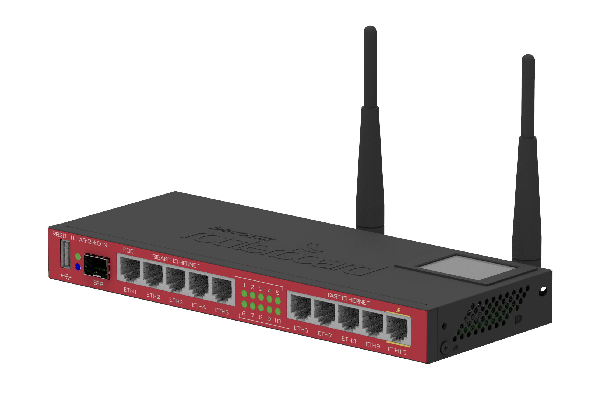

# Product Images

This section contains reference images of the hardware devices used in the RADIONET project.

---

## MikroTik RB2011UiAS-2HnD-IN

---

## MikroTik RB2011UiAS-2HnD-IN (Rear View)

---

## MikroTik RB450G

---

## MikroTik RB750UP

---

## MikroTik RB951-2n

