## HTTPS validation

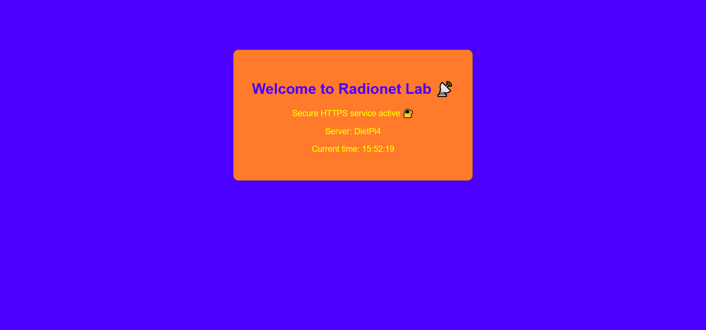

*Homepage served over HTTPS using a locally trusted certificate.*

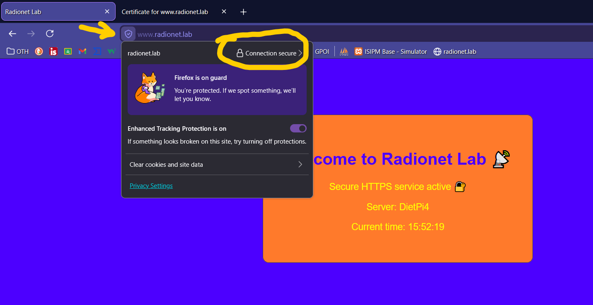

*Browser confirms trusted TLS connection for internal domain access.*

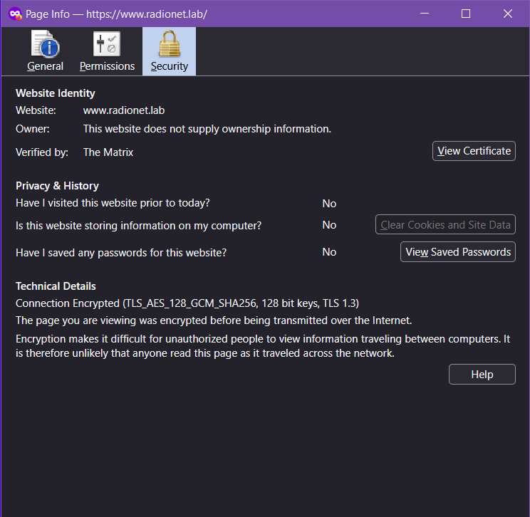

*TLS encryption details visible from browser security panel.*

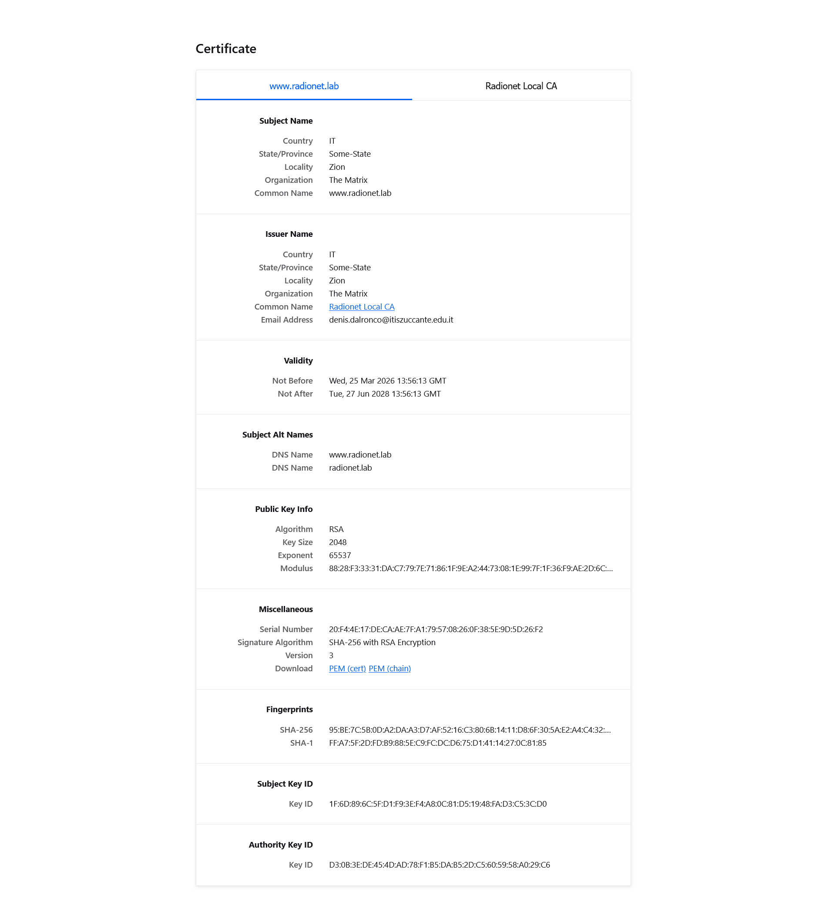

*Server certificate issued for www.radionet.lab with SAN support.*

---

## Certificate Authority

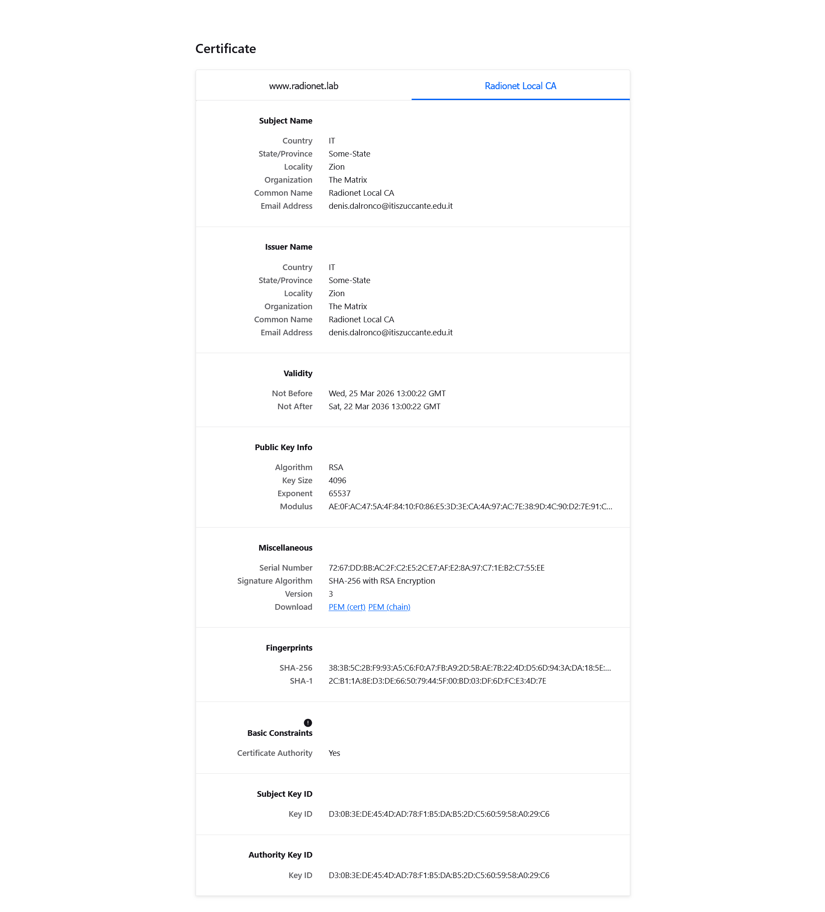

*Local certification authority used to sign internal server certificates.*

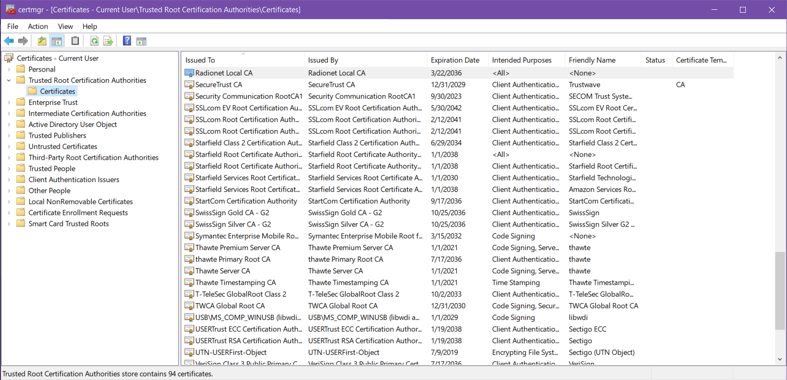

*Root CA imported into Windows trusted certificate store.*

---

## MikroTik routing and firewall

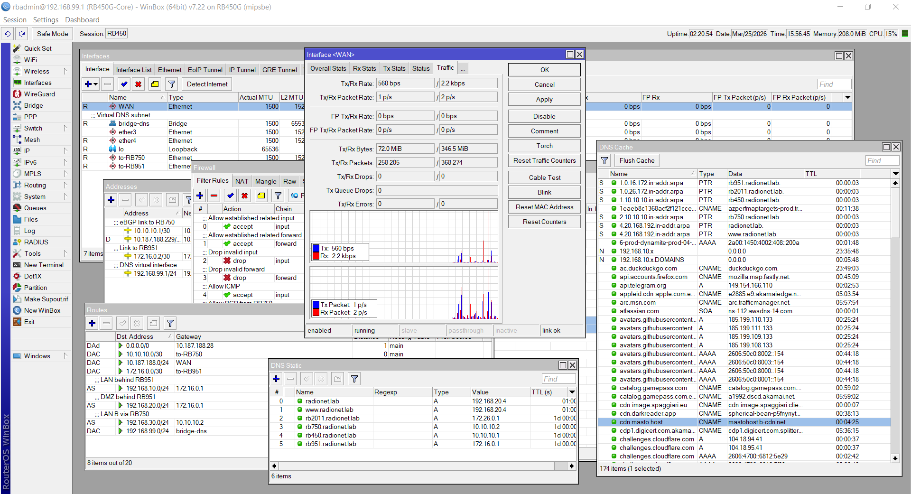

*RB450 core router managing static routes and DNS records.*

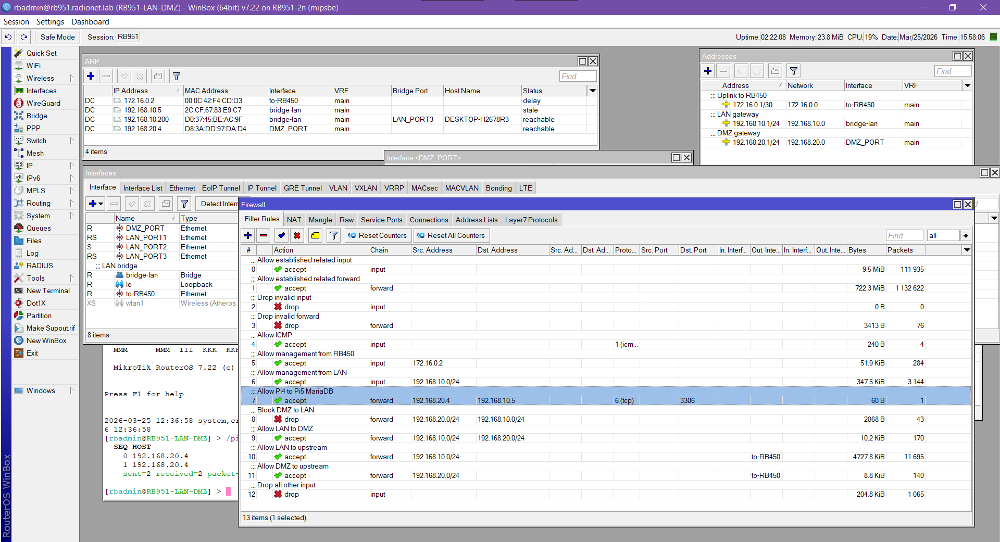

*RB951 firewall enforcing LAN and DMZ segmentation.*

---

## Raspberry Pi servers

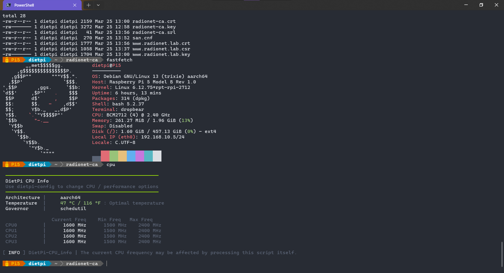

*Raspberry Pi 5 used for certificate generation and CA services.*

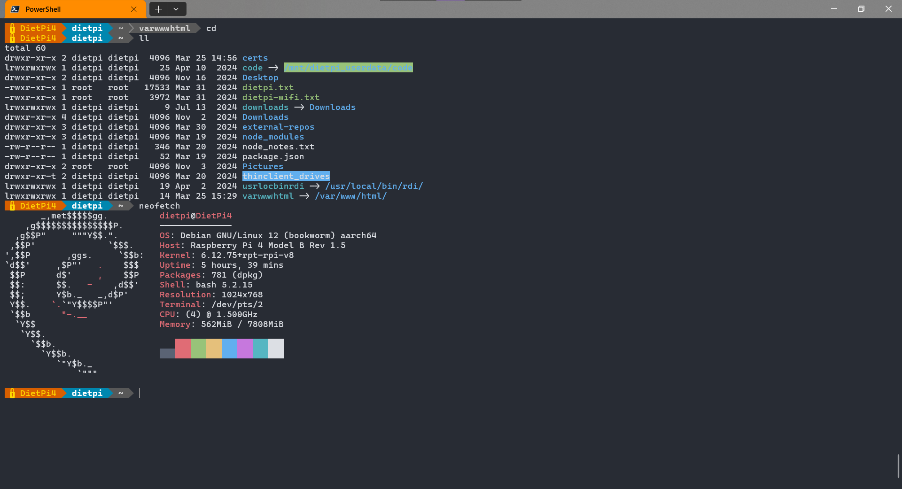

*Raspberry Pi 4 hosting HTTPS web services.*

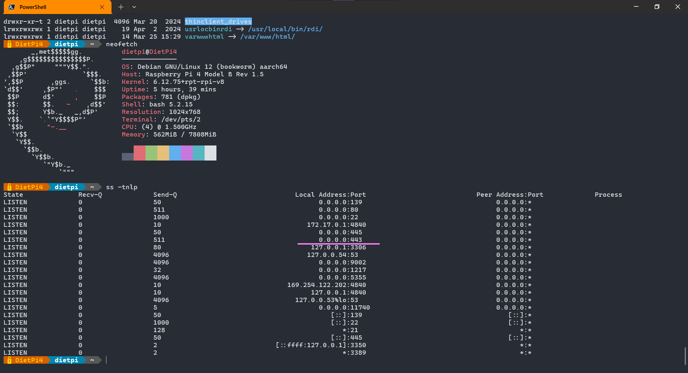

*Service bindings showing local database isolation and active listeners.*